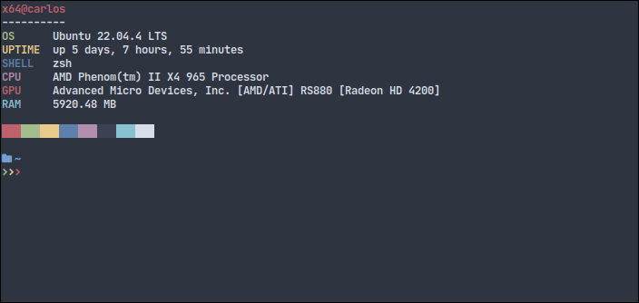

# ufetch

ufetch is a command-line tool that displays basic system information in a minimal and stylized format. It provides details such as the operating system name, CPU, RAM, uptime, and shell name.

## Installation

ufetch does not require installation. You can download the `ufetch` script and execute it directly or place it in your command directory (e.g., `/usr/local/bin/`) to use it anywhere on the system.

```bash
wget https://raw.githubusercontent.com/csq/ufetch/master/ufetch
chmod +x ufetch
sudo mv ufetch /usr/local/bin/
```

## Usage
```bash
ufetch
```

## Screenshot

This will print output similar to the following:




## Contributing

If you'd like to contribute to ufetch, please open an issue or send a pull request on GitHub.
